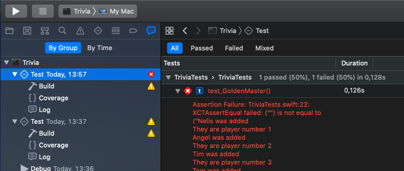
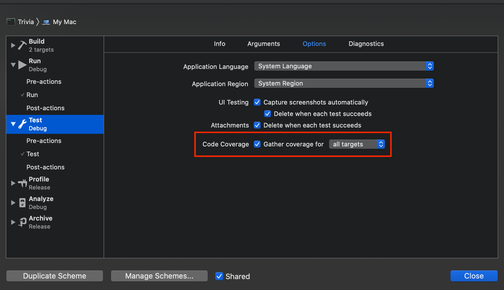
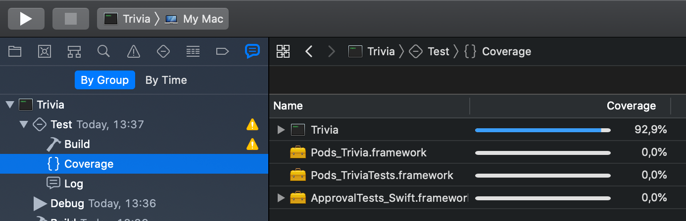

# The road towards an effective golden master

The goal of the first part of the workshop is for you to build up an effective golden master. There are several important steps to get there.

1. Get the code
2. Understand what to observe
3. Capture the output
4. Make the tests reproducible
5. Verify the result with a golden master
6. Check if the golden master is effective
7. Add more variations

## Step: Get the code

Clone the repository https://github.com/MatteoPierro/trivia.git and checkout the branch `workshop-starting-point`.
Move inside the java or the javascript folder depending on which language you want to use.

## Step: Understand what to observe

The first step in building up an effective golden master is to understand what to observe. So lets start with *running the game*. Run the game several times. Briefly study the code of the GameRunner.

<details>
  <summary>In Java </summary>
  <p> Run the main in GameRunner. Study the console output.</p>
</details>

<p/>

<details>
  <summary>In Javascript </summary>
  <p>Run 'npm install' once, then open a node shell in the root of the project and execute gamerunner function.

```bash
$ npm install
$ node
> require('./src/game-runner')()
```
</p>
</details>

<p/>

<details>
  <summary>In Swift </summary>
  <p>Open the project and run the main. Study the console output.
</p>
</details>

***Questions to answer:***

* **What do you see that will make it difficult for you to do tests?**
* **Which output needs to be captured?**

## Step: Capture the output

One thing to notice when studying the program is that the only feedback you get is on the console output. So how can you compare the your output with the golden master in this case?

You can try for yourselves, or look to our examples below.

<details>
  <summary>Example in Java </summary>
  <p>

Java provides a way to capture the console output. The trick is to define your own stream, and overwrite the `System.out` stream with the one you control. Typically we add a helper method in a test. So setup:

```java
public class GoldenMasterTest {

    @Test
    public void can_capture_the_output_game() {
        String result = runGame();

        System.out.println(result);
    }

    public String runGame() {
        ByteArrayOutputStream outputStream = new ByteArrayOutputStream();
        PrintStream printStream = new PrintStream(outputStream, true);

        PrintStream oldOut = System.out;
        System.setOut(printStream);

        GameRunner.runGame();

        System.setOut(oldOut);

        return outputStream.toString();
    }
}

```

The above example also assumes you extracted the code from the main in a static method `runGame` on the gamerunner.

In this example, outputStream.toString() contains the output of our test.

</p>
</details>

<p/>

<details>
  <summary>Example for Javascript </summary>
  <p>

For javascript we do more or less the same as for java. As javascript allows to overwrite any function, we will use this to overwrite the log function.

Open the `game.spec.js` file and add the following code.

```javascript

function runGame(){
    console.oldLog = console.log;
    var result = "";
    console.log = function (value) {
        result += value + "\n";
    };

    gameRunner();

    console.log = console.oldLog;
    return result;
}

it("should allow to capture the output", function() {
    var result = runGame();
    console.log("This is the result");
    console.log(result);
});
```

Run the test typing `npm test` in the command line. The result comes back from the runGame function. 
</p>
</details>

<p/>

<details>
  <summary>Example for Swift </summary>
  <p>
Add a protocol and class that allows to extract the print function. Later we will make a test version that captures this in a string, but for now it can still just print to the console output. 

More concretely, you could add a Console printer and adapt the Game class as shown below.

```swift
// Add a file ConsolePrinter.swift with the following implementation
public protocol Printer {
    func output(_ items: CustomStringConvertible...)
}

public class ConsolePrinter: Printer {
    public func output(_ items: CustomStringConvertible...){
        print(items.map{$0.description}.joined(separator: " "))
    }
}
```
Add the following code in Game.swift

```swift
    // Add to file Game.swift
    private var printer: Printer = ConsolePrinter()
    
    public convenience init(printer: Printer){
        self.init()
        self.printer = printer
    }
```

We add a convenience init to avoid modifying the main.swift file. 
Next we replace all ```print(```with ```printer.output(```. Then run your application and see that the output still appears correctly.

Next we have to change the main to allow for a testrun with a printer we can control from the tests:

```swift
// Replace main.swift with the code below

func play(
    aGame: Game = Game()
) {

    var notAWinner: Bool
    _ = aGame.add(playerName: "Chet")
    _ = aGame.add(playerName: "Pat")
    _ = aGame.add(playerName: "Sue")

    repeat {
        
        aGame.roll(roll: Int(arc4random_uniform(5)) + 1)
        
        if (Int(arc4random_uniform(9)) == 7) {
            notAWinner = aGame.wrongAnswer()
        } else {
            notAWinner = aGame.wasCorrectlyAnswered()
        }
        
        
        
    } while (notAWinner)
}

play()

```

Run it again and verify that the output appears correctly. 

Next we add a test that captures the output:

```swift
// Add in file TriviaTests.swift, and cleanup unused functions

    func test_captureOutput() {
        let printer = StringPrinter()
        let game = Game(printer: printer)
        
        play(aGame: game)
        
        XCTAssertEqual("",printer.text)
    }

class StringPrinter: Printer {
    private(set) var text = ""
    
    func output(_ items: CustomStringConvertible...) {
        text += items.map{$0.description}.joined(separator: " ") + "\n"
    }
}

```

We are not ready with our preparation to capture the output. This test will still fail (the output does not equal ""), but we need to fix something first before we can make it succeed (see next step).
</p>
</details>


## Step: Make the tests reproducible

The GameRunner uses a random number generator, causing the output of a run to differ every time. In this way it will be very hard to capture the output and compare it to the golden master, as every output will be different. To make such code testible, it is needed to control the randomness in the tests (so it is only really random in the production code).

<details>
  <summary>Control randomness in Java </summary>
  <p>

Java provides a way to do this, namely by passing a seed to random. Using this seed will produce the same sequence of random numbers every time.

```java
int seed = 1;                       // a seed for the random generator
Random rand = new Random(seed);
rand.nextInt();                     // will always produce the exact same result
```

To allow running the game with such controlled randomGenerator we must extract (preferably using an IDE) a runGame in the gameRunner with a random number generator as parameter.

```java
public static void runGame(Random rand) { ... }
```

Now we can make a new test that uses a random generator with a seed

```java


public class GoldenMasterTests {

    public String runGame(Integer seed) {
        ...
        GameRunner.runGame(new Random(seed));
        ...
    }

    @Test
    public void can_run_with_reproducible_output() {
         String result = runGame(1);

        System.out.println(result);
    } 
}
```

It is not a real test yet (no asserts), but at least it allows us to easily run the game and have a reproducible output. 
</p>
</details>

<p/>

<details>
  <summary>Control randomness in Javascript </summary>
  <p> 

As javascript allows to *"overwrite"* any function, we will use another trick to control randomness (described [here](https://developer.mozilla.org/en-US/docs/Web/JavaScript/Reference/Global_Objects/Math/random)). The trick is to overwrite the `Math.random` function to allow using a seed.

```javascript
function initialiseRandom(seed) {
    Math.random = function () {
        var x = Math.sin(seed++) * 10000;
        return x - Math.floor(x);
    }
}
```

Now you can use it in your test to have reproducible results.

```javascript
function runGame(seed){
    initialiseRandom(seed);
    ....
}

it("should allow to control the output", function() {
    var result = runGame(1);
    console.log("This is the result");
    console.log(result);
});
```
</p>
</details>

</p>

<details>
  <summary>Control randomness in Swift </summary>
  <p> 

Swift does not make our life easy control the random number generation. 

We need to extract the random number generation. We do this by adding a new protocol and class that generate the random numbers.

```swift 
// Add a class RandomGenerator.swift with the following implementation
import Foundation

public protocol RandomGenerator {
    func number(from: Int, until: Int) -> Int
}

class RealRandomGenerator: RandomGenerator {
    func number(from: Int = 0, until: Int) -> Int {
        Int.random(in: from ..< until)
    }
}
```

Next alter the following lines in the main:

```swift
// Alter main.swift

func play(
    random: RandomGenerator = RealRandomGenerator(),
    aGame: Game = Game()
) {

//...
        aGame.roll(roll: random.number(from: 1, until: 5))
        
        if (random.number(from: 0, until: 9) == 7) {
//...

}
```

Run the main and see that this still produces an output.

Next we will add a mock random generator that uses a fixed set of random numbers. We generated them on https://www.random.org/integers/. 

```swift
// Add to TriviaTests.swift
class MockRandomGenerator: RandomGenerator {

    var until5List = [2,5,3,3,2,2,4,4,1,3,2,1,5,3,1,5,4,3,1,5,5,1,3,4,4,1,4,5,3,2,3,5,5,1,3,3,5,3,2,5,1,3,2,1,3,3,5,5,5,1,1,1,2,5,4,2,2,1,2,3,4,1,1,2,2,2,3,5,4,2,1,2,4,3,3,2,1,2,5,1,3,3,5,1,4,3,1,3,1,1,1,3,4,3,4,3,1,3,3,4,2,5,3,3,2,2,4,4,1,3,2,1,5,3,1,5,4,3,1,5,5,1,3,4,4,1,4,5,3,2,3,5,5,1,3,3,5,3,2,5,1,3,2,1,3,3,5,5,5,1,1,3,3,5,3,2,5,1,3,2,1,3,3,5,5,5,1,1,1,2,5,4,2,2,1,2,3,4,1,1,2,2,2,3,5,4,2,1,2,4,3,3,2,1,2,5,1,3,3,5,1,4,3,1,3,1,1,1,3,4,3,4,3,1,3,3,4,2,5,3,3,2,2,4,4,1,3,2,1,5,3,1,5,4,3,1,5,5,1,3,4,4,1,4,5,3,2,3,5,5,1,3,3,5,3,2,5,1,3,2,1,3,3,5,5,5,1,2,5,3,3,2,2,4,4,1,3,2,1,5,3,1,5,4,3,1,5,5,1,3,4,4,1,4,5,3,2,3,5,5,1,3,3,5,3,2,5,1,3,2,1,3,3,5,5,5,1,1,1,2,5,4,2,2,1,2,3,4,1,1,2,2,2,3,5,4,2,1,2,4,3,3,2,1,2,5,1,3,3,5,1,4,3,1,3,1,1,1,3,4,3,4,3,1,3,3,4,2,5,3,3,2,2,4,4,1,3,2,1,5,3,1,5,4,3,1,5,5,1,3,4,4,1,4,5,3,2,3,5,5,1,3,3,5,3,2,5,1,3,2,1,3,3,5,5,5,1,1,3,3,5,3,2,5,1,3,2,1,3,3,5,5,5,1,1,1,2,5,4,2,2,1,2,3,4,1,1,2,2,2,3,5,4,2,1,2,4,3,3,2,1,2,5,1,3,3,5,1,4,3,1,3,1,1,1,3,4,3,4,3,1,3,3,4,2,5,3,3,2,2,4,4,1,3,2,1,5,3,1,5,4,3,1,5,5,1,3,4,4,1,4,5,3,2,3,5,5,1,3,3,5,3,2,5,1,3,2,1,3,3,5]
    
    var until9List = [0,1,6,0,0,1,5,8,3,4,4,1,5,8,0,4,2,6,5,6,0,4,8,3,3,1,8,5,5,1,2,7,8,0,1,5,4,6,6,3,0,6,6,2,4,1,2,4,0,7,3,3,5,5,1,7,7,0,0,6,0,3,3,8,5,5,1,2,3,6,2,5,0,5,1,8,5,1,8,0,7,2,7,7,6,2,0,6,1,0,8,7,3,7,4,4,5,8,6,2,0,1,6,0,0,1,5,8,3,4,4,1,5,8,0,4,2,6,5,6,0,4,8,3,3,1,8,5,5,1,2,7,8,0,1,5,4,6,6,3,0,6,6,2,4,1,2,4,0,7,0,1,5,4,6,6,3,0,6,6,2,4,1,2,4,0,7,3,3,5,5,1,7,7,0,0,6,0,3,3,8,5,5,1,2,3,6,2,5,0,5,1,8,5,1,8,0,7,2,7,7,6,2,0,6,1,0,8,7,3,7,4,4,5,8,6,2,0,1,6,0,0,1,5,8,3,4,4,1,5,8,0,4,2,6,5,6,0,4,8,3,3,1,8,5,5,1,2,7,8,0,1,5,4,6,6,3,0,6,6,2,4,1,2,4,0,7,0,1,6,0,0,1,5,8,3,4,4,1,5,8,0,4,2,6,5,6,0,4,8,3,3,1,8,5,5,1,2,7,8,0,1,5,4,6,6,3,0,6,6,2,4,1,2,4,0,7,3,3,5,5,1,7,7,0,0,6,0,3,3,8,5,5,1,2,3,6,2,5,0,5,1,8,5,1,8,0,7,2,7,7,6,2,0,6,1,0,8,7,3,7,4,4,5,8,6,2,0,1,6,0,0,1,5,8,3,4,4,1,5,8,0,4,2,6,5,6,0,4,8,3,3,1,8,5,5,1,2,7,8,0,1,5,4,6,6,3,0,6,6,2,4,1,2,4,0,7,0,1,5,4,6,6,3,0,6,6,2,4,1,2,4,0,7,3,3,5,5,1,7,7,0,0,6,0,3,3,8,5,5,1,2,3,6,2,5,0,5,1,8,5,1,8,0,7,2,7,7,6,2,0,6,1,0,8,7,3,7,4,4,5,8,6,2,0,1,6,0,0,1,5,8,3,4,4,1,5,8,0,4,2,6,5,6,0,4,8,3,3,1,8,5,5,1,2,7,8,0,1,5,4,6,6,3,0,6,6,2,4,1,2]
    
    func number(from: Int, until: Int) -> Int {
        if( until == 5){
            return  until5List.popLast()!
        }
        
        return until9List.popLast()!
    }
}
```

It is a (dirty) hack to control the random number generation and make it predictable for the tests.

Next change your play met test to use the mock random:

```swift
    func test_reproduceableOutput() {
        let printer = StringPrinter()
        let random = MockRandomGenerator()
        let game = Game(printer: printer)
        
        play(random: random, aGame: game)
        
        XCTAssertEqual("",printer.text)
    }
```

We are ready with making the test reproducible. You can run the tests a few time and you will see that it produces the same output every time. Tests still fail for now, as we have an empty expected value. Lets fix that next.

</p>
</details>

## Step: Verify the result with a golden master

As we now have a reproducible output to compare, we still need to do the actual comparison. We could write something ourselves, but actually there is a great tool to use in this context called [Approval Tests](http://approvaltests.com/). 

The essense of ApprovalTests is that it will keep track of golden master (called the approved version) and will compare the output of a testrun (called the received version) with the golden master. If you made functional changes that change the output, you are supposed to check it manually and upgrade the received to the approved version.

The simplest way is to add a simple verify step.

<details>
  <summary>In Java </summary>
  <p>

 ```java
@Test
public void can_run_a_controlled_game() {
    String result = runGame(1);

    Approvals.verify(result);
}
```
  
  </p>
</details>

<p/>

<details>
  <summary>In Javascript </summary>
  <p>

```javascript

function runGame(seed=1){
    initialiseRandom(seed);
    console.oldLog = console.log;
    var result = "";
    console.log = function (value) {
        result += value + "\n";
    };

    gameRunner();

    console.log = console.oldLog;
    return result;
}

it("should compare the result", function(){
    var result = runGame(1);

    this.verify(result, {reporters: ["donothing"]});
});
```

TIP for javascript: you can select an automated mere tool by changing the [reporter](https://github.com/approvals/Approvals.NodeJS#reporters).
  
  </p>
</details>

On the first run the test will still fail, as it lacks an approved version with the correct content. If you are sure this is the version you want to start from you can rename the received file to the approved file and run the tests again.

<details>
  <summary>In Swift </summary>
  <p>
    With Swift we are out of luck. The approval test library exists and we made a version where we use it, but it fails to work together with mutation testing. So we have to make our own golden master implementation.<br/>
    In order to fetch the output of your Golden Master, in Xcode open the tab "Reports" and select the failed unit test. You will find the expected output.
   </p>



<p>Copy the expected output and add it to a variable:  </p>

```swift

        var goldenMaster = """

        ... Add your golden master here ...    

        """
```
<p> Make sure you dont have extra lines.</p>
</details>

## Step: Check the quality of your tests

Now we have a golden master test but we still need to check if it is effective. ***For this we are mainly intested in the Game class***. This is done in two steps:

* Check the code coverage.
* Use mutation testing

### Check the code coverage

Run your tests with code coverage and check which parts are covered.

<details>
  <summary>Java/IntelliJ</summary>
  <p>

 Enable a more advanced tracking of code coverage by enabling tracing. 
 
Click on your build configuration for test -> Edit Configuration -> Code coverage Tab -> Tracing.

There you also need to add `com.adaptionsoft.games.uglytrivia.*` to the "Packages and classes to include in coverage data".

Now run the coverage report of InteliJ.

</p>
</details>

<p/>

<details>
  <summary>Java/Maven</summary>
  <p>

 Using commandline maven is another possibility that we configured for you. We use a maven plugin for this. Please execute the following command:

```bash
mvn clean test jacoco:report
```

Next you can open the file `target/site/jacoco/index.html` containing the coverage report.

</p>
</details>

<p/>

<details>
  <summary>Javascript</summary>
  <p>

We configured `npm test` to also produce a coverage report. 

Next you can open the file at `coverage/index.html`

</p>
</details>

<p/>

<details>
  <summary>Swift</summary>
  <p>
    When your test succeed, verify the coverage. <br/>
    Make sure you have Code Coverage Option active for your schema:
</p>


<p>
    Run your tests again and verify the code coverage from the tab "Reports" in Xcode
</p>



<p> Should be more than 90% </p>

</p>
</details>


**Which parts of the code are not coverd yet? Why?**

### Use mutation testing

The idea behind the mutation testing is that the mutation testing tool produces mutants (i.e. versions of your code with changes) that need to be killed by the tests (i.e. make the tests fail). Every mutant that survives might indicate to a test that insufficiently covers such case.

We already configured maven to run the mutation testing easily.


<details>
  <summary>Java</summary>
  <p>
    
```bash
mvn clean test -DwithHistory org.pitest:pitest-maven:mutationCoverage
```

If you open the browser and go to: the html report `target/pit-reports/<a date here>/index.html`
</p>
</details>

<p/>

<details>
  <summary>Javascript</summary>
  <p>

We also configured npm to run mutation tests.

```bash 
npm run mutation-test
```

The report can be found on `reports/mutation/html/index.html`.
</p>
</details>

<p/>

<details>
  <summary>In Swift </summary>
  <p>Ensure muter is installed. [More information](https://github.com/muter-mutation-testing/muter#installation).

  ```bash
$ brew install muter-mutation-testing/formulae/muter
  ```

Open the workspace in XCode and run the target. You also have the option to run this on the commandline:

```bash
$ muter
```
</p>
</details>

**Which mutants survived? Why?**

### Some hints

Often uncovered parts or mutants that survive fall on the following categories:

* Dead code (code that is not used). It is best to remove such code.
* Code that is not covered by tests. It is best to cover such code by tests.
* Needs more multiple *users* and *seeds* to be covered (more variation). The next section provides some tips to add more variation.

## Step: Add more variation in the golden master test

There are two ways to add more variation in the golden master tests. You can add more seeds and you can add more players, and you can combine the two.

**Play a bit with the combinations until you get most mutants killed!**

<details>
  <summary>Tips for Java</summary>
  <p>

To add multiple seeds you can use `Approvals.verifyAll()` where you can indicate you want to run re-run the test for each of the seeds.

```java
@Test
public void can_run_controlled_game_for_multiple_seeds() {
    Integer[] seeds = {1,2};

    Approvals.verifyAll(seeds,seed -> runGame(seed));
}

```

To add multiple players and multiple seeds, you can use yet another trick, namely `Approvals.verifyAllCombinations`.

But before we reach that point, we need to make the players can be injected through code. An example on how to do that below.

Make the players injectable in GameRunner by adding a second runGame method. The resulting class below. 

```java
public class GameRunner {

    private static boolean notAWinner;

    public static void main(String[] args) {
        Random rand = new Random();
        runGame(rand);
    }

    public static void runGame(Random rand){
        runGame(rand, "Chet", "Pat", "Sue");
    }

    public static void runGame(Random rand, String... players) {
        Game aGame = new Game();

        for (String player:players) {
            aGame.add(player);

        }

        do {

            aGame.roll(rand.nextInt(5) + 1);

            if (rand.nextInt(9) == 7) {
                notAWinner = aGame.wrongAnswer();
            } else {
                notAWinner = aGame.wasCorrectlyAnswered();
            }


        } while (notAWinner);
    }
}
```

After that we need to make changes to the tests. Because approval tests relies on toString of the players to see which variation it is running, we cannot directly use a string array to test. That is why we make the Players object.

```java
private class Players {
    private String[] players;

    public Players(String ... players) {
        this.players = players;
    }

    public String[] values() {
        return players;
    }

    @Override
    public String toString() {
        return String.join(",", players);
    }
}

public String runGameForSeedAndPlayers(Integer seed, Players players) {
    ByteArrayOutputStream outputStream = new ByteArrayOutputStream();
    PrintStream printStream = new PrintStream(outputStream, true);

    PrintStream oldOut = System.out;
    System.setOut(printStream);

    Random rand = new Random(seed);
    GameRunner.runGame(rand, players.players);

    System.setOut(oldOut);

    return outputStream.toString();
}

@Test
public void can_run_controlled_game_for_multiple_players() throws Exception {
    Integer[] seeds = {1, 2};
    Players[] playerCombinations = new Players[] {
            new Players(),
            new Players("Chet"),
            new Players("Chet", "Jean"),
    };

    CombinationApprovals.verifyAllCombinations(this::runGameForSeedAndPlayers, seeds, playerCombinations);
}
```
</p>
</details>

<p/>

<details>
  <summary>Tips for Javascript</summary>
  <p>

First, lets make it easy to run with several players without screwing up the existing code. We start in the gamerunner.js file.

```javascript
module.exports = function (players=['Chet', 'Pat', 'Sue']) {
    var notAWinner = false;

    var game = new Game();

    for (var player in players ) {
        game.add(players[player]);
    }
    
    do {

        game.roll(Math.floor(Math.random() * 6) + 1);

        if (Math.floor(Math.random() * 10) == 7) {
            notAWinner = game.wrongAnswer();
        } else {
            notAWinner = game.wasCorrectlyAnswered();
        }

    } while (notAWinner);
};  
```

Next we should also update the runGame in the game.spec.js file to easily run the game with different player combinations. 

```javascript
function runGame(seed=1, players){
    initialiseRandom(seed);
    console.oldLog = console.log;
    var result = "";
    console.log = function (value) {
        result += value + "\n";
    };

    gameRunner(players);

    console.log = console.oldLog;
    return result;
}
```

Next you can add tests with combinations of seeds and players, like

```javascript

it("2 players", function () {
    this.verify(runGame(9, ["Matteo", "John"]), {reporters: ["donothing"]});
});

```

The javascript library does not have the fancy verifyAll or VerifyAllCombinations. You will have to write our the tests yourself.
</p>
</details>

<p/>


<details>
  <summary>Tips for swift</summary>
  <p>In order to kill all the mutants try this options:</p>
  
    - Generate a nuw random number list
    - Increase the number of game
    - Increase the number of players
    
  <p>Remember that you have to create a new golder master after any modification of the test.</p>
</details>

<p/>
<details>
  <summary>Click to see a hint what to add to kill the maximum amount of mutants </summary>
  <p>

  Through experimentation and studying the code we found  that 0 till 6 players and specific seeds kills the maximal amount of mutants. The java seeds are 3 and 5. Javascript seeds are 3, 5, 7, 77.

  Even with approval testing with all combinations you will probably not be able to cover `for (int i = 0; i < 50; i++) {`. As it is in the initialisation of the questions, lets ignore it for now.  

  And for javascript mutation testing, Array(6) does not differ from Array(), as all Arrays are unlimited. It is safe to ignore.
  
  </p>
</details>
